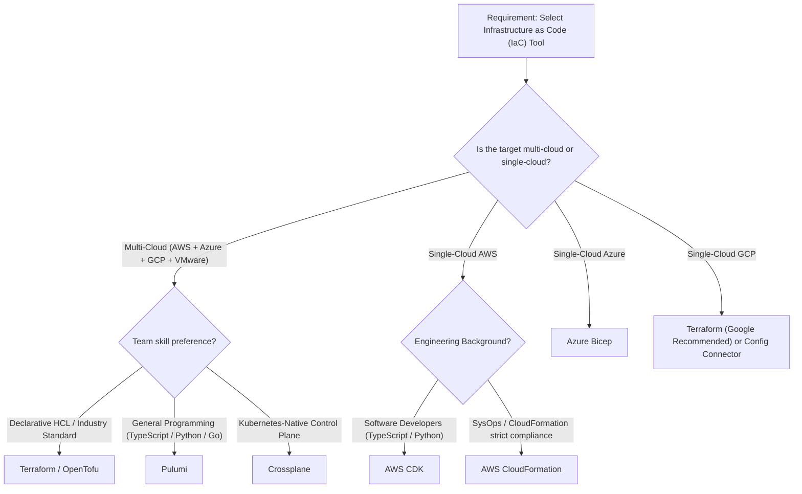

# Multi-Cloud Infrastructure & Tooling Comparison Matrix

> **Document Status**: Official Architecture Reference  
> **Audience**: Cloud Architects, Platform Engineers, DevOps Engineers, and SREs  
> **Scope**: AWS, Microsoft Azure, Google Cloud Platform (GCP), VMware Cloud Foundation (VCF/Tanzu), and Open-Source Ecosystems.

---

## 1. Executive Summary & Architectural Mental Model

Engineering teams transitioning across private cloud and public hyperscalers often struggle with disparate naming conventions for identical architectural capabilities. 

This reference specification establishes an enterprise **Rosetta Stone** mapping matrix. Foundationally, engineers with private cloud mastery (specifically VMware enterprise infrastructure) already understand the primitives of cloud computing:

$$\begin{aligned}
\text{VMware vSphere / ESXi} &\iff \text{Compute (IaaS VMs \& Hypervisors)} \\
\text{VMware NSX-T} &\iff \text{Software-Defined Networking (VPC, Subnets, Microsegmentation, DFW, ALB)} \\
\text{VMware vSAN / VMFS} &\iff \text{Block \& Software-Defined Storage (EBS, Managed Disks, PD)} \\
\text{VMware Tanzu (TKG / TKGI)} &\iff \text{Containers as a Service (CaaS) \& Managed Kubernetes (EKS, AKS, GKE)} \\
\text{Tanzu Continuous Delivery / ArgoCD} &\iff \text{GitOps Declarative Reconcilers}
\end{aligned}$$

---

## 2. Cross-Cloud Infrastructure Services Comparison

### 2.1 Compute & Virtualization

| Capability / Function | Amazon Web Services (AWS) | Microsoft Azure | Google Cloud Platform (GCP) | VMware Private Cloud (VCF) |
|---|---|---|---|---|
| **Virtual Machines (IaaS)** | Amazon EC2 (Elastic Compute Cloud) | Azure Virtual Machines | Google Compute Engine (GCE) | VMware vSphere / ESXi Host VMs |
| **Instance Hardware Profiles** | EC2 Instance Types (e.g., `m6i.xlarge`, `c7g.2xlarge`) | Azure VM Sizes (e.g., `Standard_D4s_v5`) | Machine Types (e.g., `n2-standard-4`, `t2d`) | VM Hardware Versions & Sizing Profiles |
| **Elastic Autoscaling** | EC2 Auto Scaling Groups (ASG) | Virtual Machine Scale Sets (VMSS) | Managed Instance Groups (MIG) | vSphere DRS (Distributed Resource Scheduler) |
| **Bare Metal Instances** | EC2 Bare Metal (`*.metal`) | Azure BareMetal Infrastructure | Bare Metal Solution (BMS) | Native Bare Metal Physical Hosts |
| **Serverless Compute (FaaS)** | AWS Lambda | Azure Functions | Cloud Functions / Cloud Run | Knative / VMware Tanzu Functions |
| **Container Instances (Serverless CaaS)** | AWS Fargate (ECS / EKS) | Azure Container Instances (ACI) | Google Cloud Run | — |
| **Batch Computing** | AWS Batch | Azure Batch | Cloud Batch | — |

---

### 2.2 Containers & Kubernetes Platforms (CaaS)

| Capability / Function | Amazon Web Services (AWS) | Microsoft Azure | Google Cloud Platform (GCP) | VMware Private Cloud (VCF / Tanzu) | Open-Source / Industry Standard |
|---|---|---|---|---|---|
| **Managed Kubernetes** | Amazon EKS (Elastic Kubernetes Service) | Azure Kubernetes Service (AKS) | Google Kubernetes Engine (GKE) | VMware Tanzu Kubernetes Grid (TKG) | Kubernetes (Upstream `k8s.io`) |
| **Enterprise Platform & Orchestration** | EKS + Karpenter + Add-ons | AKS + Automatic + KEDA | GKE Autopilot | VMware Tanzu Platform (TKGI / TAP) | Red Hat OpenShift / Rancher |
| **Container Registry** | Amazon ECR (Elastic Container Registry) | Azure Container Registry (ACR) | Artifact Registry (formerly GCR) | Harbor (Integrated in Tanzu) | Harbor / OCI Registry |
| **Service Mesh** | AWS App Mesh / Istio on EKS | Azure Service Mesh (Managed Istio) | Cloud Service Mesh (Managed Istio) | Tanzu Service Mesh (Istio-based) | Istio / Linkerd / Cilium Mesh |
| **Cluster Autoscaler** | Karpenter / Cluster Autoscaler | AKS Cluster Autoscaler / KEDA | GKE Cluster Autoscaler | Tanzu Cluster Autoscaler | Kubernetes Cluster Autoscaler |
| **GitOps Reconciler** | ArgoCD / Flux (Self-Managed) | Flux Extension for AKS | Anthos Config Management (ACM) | Tanzu Continuous Delivery (ArgoCD) | ArgoCD / Flux CD |

---

### 2.3 Storage Services

| Capability / Function | Amazon Web Services (AWS) | Microsoft Azure | Google Cloud Platform (GCP) | VMware Private Cloud (VCF) |
|---|---|---|---|---|
| **Object Storage** | Amazon S3 (Simple Storage Service) | Azure Blob Storage | Google Cloud Storage (GCS) | MinIO / VMware Cloudian HyperStore |
| **Block Storage** | Amazon EBS (Elastic Block Store) | Azure Managed Disks | Persistent Disk (Zonal / Regional PD) | VMware vSAN Datastore / VMFS SAN/NAS |
| **Managed File System (NFS/SMB)** | Amazon EFS / FSx for NetApp ONTAP | Azure Files / Azure NetApp Files | Google Cloud Filestore | vSAN File Services |
| **Cold Storage / Archival** | Amazon S3 Glacier Flexible / Deep Archive | Azure Blob Archive Tier | Cloud Storage Archive Class | Tape Libraries / Offline Datastores |
| **Kubernetes CSI Driver** | AWS EBS CSI / EFS CSI | Azure Disk CSI / Azure File CSI | GCE Persistent Disk CSI | VMware vSphere CSI Driver (CNS) |

---

### 2.4 Software-Defined Networking & Hybrid Connectivity

| Capability / Function | Amazon Web Services (AWS) | Microsoft Azure | Google Cloud Platform (GCP) | VMware Private Cloud (NSX) |
|---|---|---|---|---|
| **Virtual Isolated Network** | Virtual Private Cloud (VPC) | Virtual Network (VNet) | Virtual Private Cloud (VPC) | NSX-T Virtual Network / Overlay Tier-0/1 |
| **Subnet Partitioning** | VPC Subnet (AZ-scoped) | VNet Subnet | Subnet (Region-scoped) | NSX Segment |
| **Stateful Firewall / Microsegmentation** | Security Groups / Network ACLs | Network Security Groups (NSG) | VPC Firewall Rules / Hierarchical Policies | NSX Distributed Firewall (DFW) |
| **L4 Load Balancer** | Network Load Balancer (NLB) | Azure Load Balancer (Standard) | Cloud Network Load Balancer (Pass-through) | NSX Advanced Load Balancer (Avi Networks) |
| **L7 Application Load Balancer** | Application Load Balancer (ALB) | Azure Application Gateway | Cloud HTTP(S) Load Balancer | NSX ALB (Avi Networks) |
| **Managed DNS Service** | Amazon Route 53 | Azure DNS / Private DNS Zones | Google Cloud DNS | CoreDNS / BIND / Infoblox |
| **Private Service Endpoints** | AWS PrivateLink / VPC Endpoints | Azure Private Link / Private Endpoints | Google Private Service Connect (PSC) | NSX Service Definitions |
| **Site-to-Site IPSec VPN** | AWS Site-to-Site VPN | Azure VPN Gateway | Google Cloud VPN (HA VPN) | NSX Edge IPsec VPN |
| **Dedicated Direct Interconnect** | AWS Direct Connect (DX) | Azure ExpressRoute | Google Cloud Interconnect | VMware Direct Cloud / Dedicated MPLS |
| **Software-Defined Overlay (SDN)** | AWS VPC Overlay Routing | Azure Virtual WAN Overlay | Google Andromeda SDN | VMware NSX-T Data Center |

---

## 3. Infrastructure as Code (IaC) Tooling Matrix

Infrastructure as Code forms the foundational layer of modern platform delivery. The table below evaluates the primary declarative and imperatively generated IaC frameworks.

| Tool | Vendor / Stewardship | Target Platforms | Language / DSL | State Management | Architectural Strengths & Use Cases |
|---|---|---|---|---|---|
| **Terraform** | HashiCorp (IBM) | Multi-Cloud (AWS, Azure, GCP, VMware, K8s) | HashiCorp Configuration Language (HCL) | Remote State File (`terraform.tfstate`) with State Locking | The global industry standard for multi-cloud platform provisioning. Immense provider ecosystem (>3,000 providers). Excellent drift detection. |
| **OpenTofu** | Linux Foundation | Multi-Cloud (AWS, Azure, GCP, VMware, K8s) | HCL | Remote State File compatible with Terraform v1.5.x | Pure open-source community fork under MPL 2.0. Drop-in replacement for Terraform to mitigate HashiCorp BSL licensing restrictions. |
| **AWS CDK** | Amazon Web Services | AWS Exclusive | TypeScript, Python, Go, Java, C# | Generates AWS CloudFormation Stacks | Developer-centric IaC using high-level OOP constructs. Features L2/L3 constructs with sensible security defaults, automated IAM generation, and synthesized CloudFormation. |
| **AWS CloudFormation** | Amazon Web Services | AWS Exclusive | YAML / JSON | AWS Managed Engine (Stack State) | Native AWS engine. Zero state-file infrastructure to host manually. Supports drift detection, StackSets, and native Rollback triggers. |
| **Azure Bicep** | Microsoft | Azure Exclusive | Bicep Domain-Specific Language (DSL) | Compiles to ARM Templates (Azure Resource Manager) | First-class declarative syntax for Azure. Day-zero support for newly released Azure Resource Providers. No local state file management required. |
| **Azure ARM Templates** | Microsoft | Azure Exclusive | JSON | Azure Resource Manager Engine | Native JSON deployment engine for Azure. Highly verbose and complex; largely superseded by Bicep for direct human authoring. |
| **Google Cloud Config Connector** | Google Cloud | GCP Exclusive (via Kubernetes) | Kubernetes Custom Resource Definitions (CRDs) | Kubernetes `etcd` | Manages GCP resources declaratively using Kubernetes manifests, integrating infrastructure provisioning directly into K8s GitOps flows. |
| **Pulumi** | Pulumi Corp. | Multi-Cloud (AWS, Azure, GCP, VMware, K8s) | TypeScript, Python, Go, C#, Java | Pulumi Service / S3 / GCS / Azure Blob State Backend | Full programming language expressive power (loops, conditionals, standard testing libraries like `pytest` and `jest`). Strong for platform engineering teams. |
| **Crossplane** | CNCF (Graduated / Incubating) | Multi-Cloud (AWS, Azure, GCP) via Providers | Kubernetes CRD / Declarative YAML | Kubernetes `etcd` Reconciler Loop | Transforms Kubernetes into a universal control plane. Cloud resources behave as Kubernetes objects with continuous active reconciliation against drift. |
| **Ansible** | Red Hat | Multi-Cloud + On-Premises Bare Metal & OS | YAML (Playbooks) | Stateless (Idempotent Execution Model) | Premier configuration management and host provisioning tool. Ideal for day-2 configuration, OS hardening, package updates, and hybrid VM fleet management. |
| **CDK for Terraform (CDKTF)** | HashiCorp | Multi-Cloud | TypeScript, Python, Go, C#, Java | Synthesizes Terraform HCL / JSON | Bridges the gap between OOP languages and multi-cloud Terraform state engines. |

---

## 4. CI/CD Pipelines & GitOps Delivery Frameworks

| Tool / Platform | Category | Primary Target | Configuration Language | Key Operational Characteristics |
|---|---|---|---|---|
| **GitHub Actions** | Hosted / Self-Hosted CI/CD | Multi-Cloud & Hybrid | YAML (`.github/workflows/*.yml`) | Deep integration with GitHub source code. Massive public marketplace of reusable composite actions. Native OIDC authentication for AWS, Azure, and GCP without static secrets. |
| **GitLab CI/CD** | Unified DevOps Platform | Multi-Cloud & Kubernetes | YAML (`.gitlab-ci.yml`) | Comprehensive end-to-end platform (source, pipelines, security scanning, container registry). Built-in GitLab Kubernetes Agent for cluster sync. |
| **Azure DevOps Pipelines** | Enterprise CI/CD Service | Azure, Multi-Cloud, On-Premises | YAML / Classic UI | Enterprise standard in Microsoft environments. Mature integration with Azure Boards, Repos, and Artifacts. Strong support for multi-stage approvals. |
| **AWS CodePipeline** | AWS Native Delivery Engine | AWS Exclusive | AWS Management / CDK / Terraform | Fully managed orchestrator integrating CodeBuild (runners), CodeDeploy (blue/green canary), and ECS/EKS targets. |
| **ArgoCD** | Declarative GitOps Controller | Kubernetes Clusters | Kubernetes CRDs (`Application`, `AppProject`) | Pull-based architecture running inside Kubernetes. Continuously reconciles cluster state against Git. Features rich real-time visual UI, automated health checks, and rollbacks. |
| **Flux CD** | Declarative GitOps Controller | Kubernetes Clusters | Kubernetes CRDs (`GitRepository`, `Kustomization`) | Lightweight, modular CNCF Graduated project. Built directly into Azure AKS as a managed extension. Excellent multi-tenant security architecture. |
| **Tanzu Continuous Delivery** | Enterprise GitOps Platform | VMware Tanzu Platform / Kubernetes | Declarative GitOps Manifests | VMware Tanzu enterprise integration of ArgoCD, optimized for secure multi-cluster application delivery across private and public clouds. |
| **Tekton Pipelines** | Cloud-Native CI Engine | Kubernetes Native | Kubernetes CRDs (`Pipeline`, `Task`, `PipelineRun`) | Native Kubernetes primitives for CI. Highly modular, serverless execution without dedicated daemon runners. |
| **Dagger** | Programmable CI Engine | Universal (Portable across any CI runner) | Go, Python, TypeScript (GraphQL engine) | Executes pipeline steps inside isolated OCI containers with aggressive caching. Enables running the identical pipeline locally on developer laptops and inside remote CI. |
| **Jenkins** | Classic Self-Hosted CI/CD | Universal Legacy & Modern | Groovy (`Jenkinsfile`) | Battle-tested and infinitely extensible via plugins, but carries high operational maintenance and patch overhead. |

---

## 5. Observability, Monitoring & Telemetry

| Functional Capability | Amazon Web Services (AWS) | Microsoft Azure | Google Cloud Platform (GCP) | Open-Source & Industry Standards |
|---|---|---|---|---|
| **Metrics Collection** | Amazon CloudWatch Metrics | Azure Monitor Metrics | Google Cloud Monitoring | Prometheus / VictoriaMetrics |
| **Centralized Log Aggregation** | Amazon CloudWatch Logs | Azure Monitor Logs (Log Analytics) | Google Cloud Logging | Grafana Loki / Fluentbit / OpenSearch |
| **Distributed Tracing** | AWS X-Ray | Azure Application Insights | Google Cloud Trace | Jaeger / Grafana Tempo |
| **Dashboards & Visualization** | CloudWatch Dashboards | Azure Workbooks | Cloud Monitoring Dashboards | Grafana (Multi-Cloud Industry Standard) |
| **Alerting Engine** | CloudWatch Alarms / EventBridge | Azure Monitor Alert Rules | Cloud Monitoring Alerting | Prometheus Alertmanager |
| **Application Performance Monitoring (APM)** | CloudWatch Application Signals | Azure Application Insights | Google Cloud Trace / Profiler | Datadog / Dynatrace / New Relic |
| **Telemetry Standard** | AWS Distro for OpenTelemetry (ADOT) | Azure Monitor OpenTelemetry Exporter | Google Cloud OpenTelemetry Exporter | **OpenTelemetry (OTel)** Standard |

---

## 6. Identity, Access Management & Security Governance

| Capability / Function | Amazon Web Services (AWS) | Microsoft Azure | Google Cloud Platform (GCP) | VMware Private Cloud (VCF) |
|---|---|---|---|---|
| **Identity & Access Management** | AWS IAM (Users, Groups, Roles, Policies) | Microsoft Entra ID (formerly Azure AD) | Google Cloud IAM | vSphere SSO / Active Directory / LDAP |
| **Workload / Pod Identity** | IAM Roles for Service Accounts (IRSA) / EKS Pod Identity | Azure Workload Identity / Managed Identities | Workload Identity Federation | Service Account Token Volume Projection |
| **Key Management (KMS)** | AWS Key Management Service (AWS KMS) | Azure Key Vault (Keys) | Google Cloud KMS | VMware vSphere KMS / Native Key Provider |
| **Secrets Management** | AWS Secrets Manager / Parameter Store | Azure Key Vault (Secrets) | Google Secret Manager | HashiCorp Vault (Enterprise Standard) |
| **Policy-as-Code** | AWS Service Control Policies (SCPs) | Azure Policy | GCP Organizational Policies | OPA Gatekeeper / Kyverno (Kubernetes) |
| **Zero Trust Network Access (ZTNA)** | AWS Verified Access | Microsoft Entra Private Access | Google BeyondCorp Enterprise | VMware Tanzu Service Mesh / Workspace ONE |
| **Container Image Vulnerability Scanning** | Amazon Inspector / ECR Basic Scanning | Microsoft Defender for Containers | Artifact Analysis Vulnerability Scanning | Harbor Trivy / Clair Scanner |

---

## 7. Databases & Enterprise Data Platforms

| Data Engine / Architectural Role | Amazon Web Services (AWS) | Microsoft Azure | Google Cloud Platform (GCP) | Open-Source / Cross-Cloud Standard |
|---|---|---|---|---|
| **Relational Database (OLTP)** | Amazon RDS (PostgreSQL, MySQL, SQL Server) | Azure Database for PostgreSQL / MySQL Flexible Server | Google Cloud SQL | PostgreSQL / MySQL |
| **Cloud-Native Scalable Relational** | Amazon Aurora (PostgreSQL / MySQL) | Azure Cosmos DB for PostgreSQL (Citus) | Google Cloud Spanner / AlloyDB | CockroachDB / YugabyteDB |
| **NoSQL Document Database** | Amazon DynamoDB / DocumentDB | Azure Cosmos DB | Google Cloud Firestore / Bigtable | MongoDB / Apache Cassandra |
| **Enterprise Cloud Data Warehouse** | Amazon Redshift | Azure Synapse Analytics / Microsoft Fabric | Google BigQuery | Snowflake / ClickHouse |
| **Data Lakehouse & Unified Analytics** | Amazon S3 + AWS Lake Formation + EMR | Azure Data Lake Storage Gen2 + Databricks | Google Cloud Storage + Dataplex | **Databricks** (Unified Multi-Cloud) |
| **Real-Time Event Streaming** | Amazon Kinesis Data Streams / Amazon MSK | Azure Event Hubs | Google Cloud Pub/Sub | Apache Kafka / Redpanda |

---

## 8. Enterprise Hierarchy, Landing Zones & Cloud Governance

| Governance Dimension | Amazon Web Services (AWS) | Microsoft Azure | Google Cloud Platform (GCP) | VMware Private Cloud (VCF) |
|---|---|---|---|---|
| **Resource Hierarchy** | AWS Organizations $\rightarrow$ Organizational Units (OUs) $\rightarrow$ Accounts | Management Groups $\rightarrow$ Subscriptions $\rightarrow$ Resource Groups | Organization $\rightarrow$ Folders $\rightarrow$ Projects | vCenter Server $\rightarrow$ Datacenter $\rightarrow$ Cluster $\rightarrow$ Resource Pool |
| **Landing Zone Reference Framework** | AWS Control Tower / Landing Zone Accelerator (LZA) | Azure Landing Zones (Cloud Adoption Framework / CAF) | Google Cloud Landing Zone Foundation | VMware Cloud Foundation (VCF) Architecture |
| **Automated Account Provisioning** | Account Factory for Terraform (AFT) | Subscription Vending Machine (SVM) | Project Factory Terraform Module | vRealize / VMware Aria Automation |
| **Cost Management & FinOps** | AWS Cost Explorer / AWS Budgets / Cost Anomaly Detection | Azure Cost Management + Billing / Azure Advisor | Google Cloud Billing Reports / Cost Table | VMware Aria Cost (formerly CloudHealth) |

---

## 9. Architectural Decision Matrix: Tool Selection Guide

### Key Decision Heuristics:
1. **Choose Terraform / OpenTofu** when:
   - Managing infrastructure across more than one hyperscaler or bridging on-premises VMware environments with public cloud.
   - Standardizing company-wide compliance via a unified module registry and reusable HCL architectures.
2. **Choose AWS CDK** when:
   - Developing greenfield applications strictly on AWS where application developers write both application code and infrastructure in TypeScript, Python, or Go.
   - Leveraging higher-level constructs (L2/L3) to automatically generate optimal security groups, IAM roles, and VPC peering connections.
3. **Choose Azure Bicep** when:
   - Standardizing strictly on Microsoft Azure and requiring day-zero resource support without the overhead of remote state files.
4. **Choose ArgoCD / Tanzu Continuous Delivery** when:
   - Managing Kubernetes workloads (EKS, AKS, GKE, Tanzu). All manifest drift is immediately surfaced and reconciled from Git as the single source of truth.

---

## 10. Document Revision History

| Version | Date | Author / Working Group | Change Description |
|---|---|---|---|
| `1.0.0` | `2026-10-09` | Platform Engineering & Architecture | Initial formal publication of the Multi-Cloud Infrastructure & Tooling Comparison Matrix with complete cross-platform mappings. |
