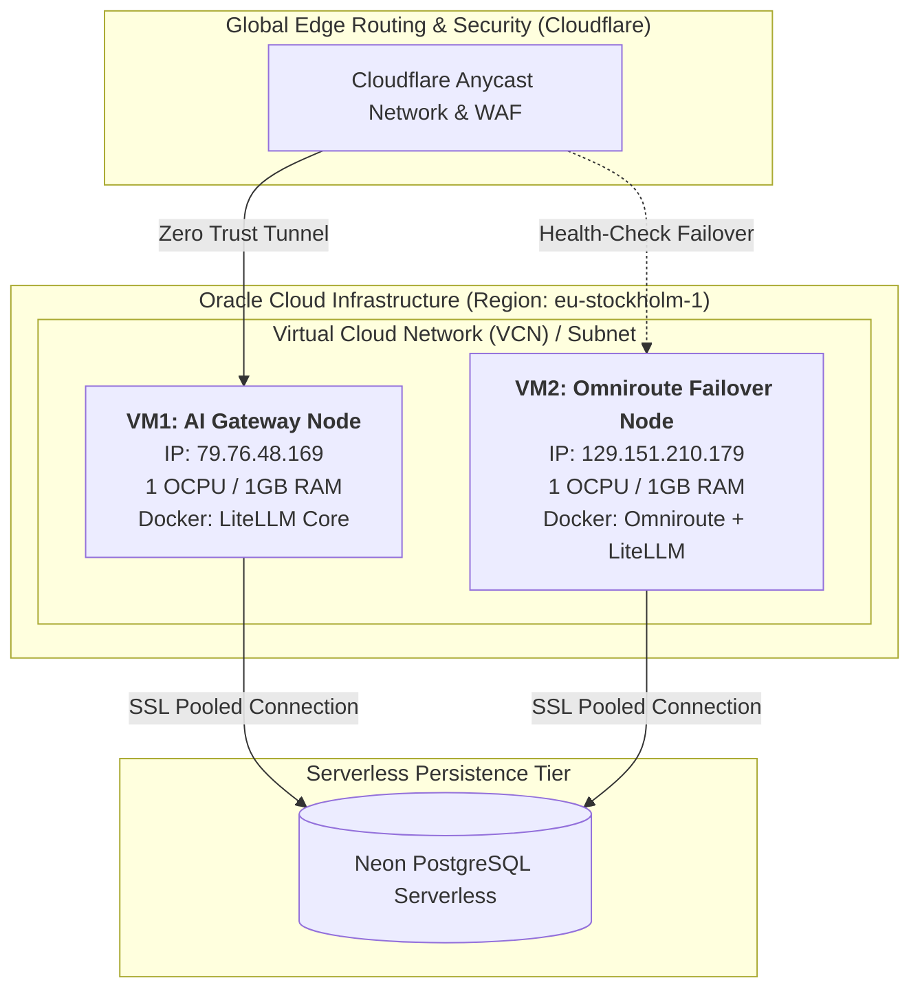

# 🌐 Multi-Cloud Infrastructure as Code (IaC) & GitOps Foundations


-brightgreen)

> **Repository**: `iac-cloud-infrastructure`  
> **Purpose**: Production-grade Infrastructure as Code (IaC) managing resilient multi-cloud compute nodes, network topologies, and automated edge failovers via declarative HCL and GitOps workflows.

---

## 🏛 System Architecture

This repository declaratively manages an **Active-Passive / Multi-Node High Availability Architecture** running on Oracle Cloud Infrastructure (Stockholm Region `eu-stockholm-1`) behind Cloudflare edge routing:



---

## 🚀 Key Engineering Highlights

1. **Declarative Brownfield Adoption (Terraform 1.5+ Native Imports)**:
   - Uses native `import` blocks to manage pre-existing cloud assets into code state without downtime or destructive recreate cycles.
2. **GitOps & Single Source of Truth**:
   - All cloud modifications undergo Pull Request reviews (`terraform plan`) prior to automated promotion (`terraform apply`).
3. **Stateless Compute & Right-Sized Architecture**:
   - Compute instances operate strictly stateless; business state resides in external serverless storage, allowing instantaneous disaster recovery and teardown.
4. **Air-Gapped Secrets & Zero Credential Exposure**:
   - No private keys, sensitive passwords, or `.tfstate` files are tracked in Git. Sensitive inputs are injected dynamically via encrypted environment variables.

---

## 📂 Project Structure

```text
iac-cloud-infrastructure/
├── .gitignore         # Strict security ignore list (blocks *.key, *.tfstate, .env)
├── README.md          # Project overview, architecture diagrams, and runbooks
├── versions.tf        # Provider requirements (Terraform >= 1.5, OCI >= 6.0)
├── variables.tf       # Parameterized infrastructure inputs (OCIDs, regions, shapes)
├── main.tf            # Managed compute instances & native import blocks
└── outputs.tf         # Declarative outputs (Public IPs, operational states)
```

---

## 🛠 Quickstart: Operational Runbook

### 1. Prerequisites
- [Terraform CLI](https://developer.hashicorp.com/terraform/install) `>= 1.5.0`
- OCI Account API Signing Key and User OCID

### 2. Initialization & Plan
```bash
# Initialize providers and remote state
terraform init

# Run pre-flight inspection and review planned diffs
terraform plan
```

### 3. Apply Configuration
```bash
# Deploy declarative changes to the cloud
terraform apply
```

---

## 🛡 Security & Compliance
- **Zero Hardcoded Secrets**: Protected by pre-commit hygiene and air-gapped secret management.
- **State Management**: Remote encrypted state backend with atomic state locking to prevent concurrent mutations.
