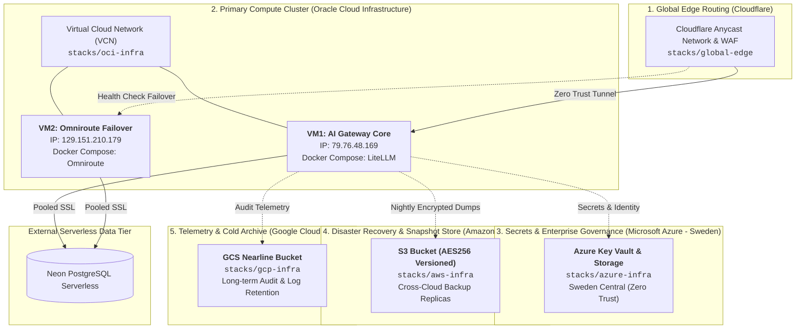

# 🌐 Enterprise Multi-Cloud Infrastructure as Code (IaC)


-blue)


> **Repository**: `iac-cloud-infrastructure`  
> **Architecture Pattern**: Layered & Modular Multi-Cloud Topology with State Boundary Isolation  
> **Managed Footprint**: Oracle Cloud (Stockholm), Microsoft Azure (Sweden Central), Amazon Web Services, Google Cloud, Cloudflare Global Edge.

---

## 🏛 Multi-Cloud Architecture Topology

This repository orchestrates a production-grade, multi-cloud foundation designed for **zero single-point-of-failure (SPOF)**, cross-cloud disaster recovery, and edge-routed low latency:



---

## 📐 Architecture Design Principles

### 1. 🛡️ Blast Radius Isolation
Instead of a monolithic `main.tf` binding all cloud providers into a single state file, this repository strictly separates state boundaries by **Cloud Provider**:
* Modifying OCI compute firewall will **never** trigger resource locks or risk regressions against AWS or GCP states.
* An outage in one cloud provider's API endpoint does not block continuous deployment pipelines across the other providers.

### 2. 🧱 Modular Reusability (DRY Infrastructure)
* Shared infrastructure patterns (compute provisioning, DNS health routing) are abstracted under [`modules/`](file:///Users/icapsule/Developer/iac-cloud-infrastructure/modules/).
* Environment/Stack root modules instantiate these reusable components with parameterized variables.

### 3. 🔄 Stateless Compute & Cattle Architecture
* OCI compute instances run containerized workloads (via Docker Compose) and store zero persistent business state locally.
* Stateful databases reside in managed serverless PostgreSQL (Neon).
* Compute nodes can be torn down and recreated in under 3 minutes via Terraform with zero data loss.

### 4. 🔒 Zero-Trust Secrets Hygiene
* Air-gapped secrets management: **Zero credentials, API tokens, or SSH private keys are checked into Git.**
* All variables marked `sensitive = true` are injected at runtime via encrypted environment variables or Terraform Cloud workspace settings.

---

## 📂 Repository Topology

```text
iac-cloud-infrastructure/
├── .gitignore                      # Comprehensive security ignore rules
├── README.md                       # Architecture documentation & operational runbooks
│
├── modules/                        # 🧱 Reusable Infrastructure Modules
│   ├── oci-compute-node/           # OCI Compute instance & tagging module
│   └── cloudflare-dns-failover/    # Cloudflare multi-origin DNS routing module
│
└── stacks/                         # 🌐 Independent State Boundaries
    ├── global-edge/                # Cloudflare DNS & Global Anycast Routing
    │   ├── versions.tf
    │   ├── main.tf
    │   ├── variables.tf
    │   └── outputs.tf
    │
    ├── oci-infra/                  # OCI Primary & Secondary Compute Nodes
    │   ├── versions.tf             # Native import blocks for Brownfield assets
    │   ├── main.tf
    │   ├── variables.tf
    │   └── outputs.tf
    │
    ├── azure-infra/                # Microsoft Azure Key Vault & Blob Store
    │   ├── versions.tf
    │   ├── main.tf
    │   ├── variables.tf
    │   └── outputs.tf
    │
    ├── aws-infra/                  # AWS Cross-Cloud DR & S3 Backup Storage
    │   ├── versions.tf
    │   ├── main.tf
    │   ├── variables.tf
    │   └── outputs.tf
    │
    └── gcp-infra/                  # GCP Telemetry Archive & Nearline Storage
        ├── versions.tf
        ├── main.tf
        ├── variables.tf
        └── outputs.tf
```

---

## 🛠 Operational Runbook: Deploying a Stack

Each stack operates independently. Navigate into the target stack directory:

### Step 1: Manage OCI Compute Stack
```bash
cd stacks/oci-infra

# Initialize provider plugins (OCI >= 6.0)
terraform init

# Review execution plan (verifies native import blocks against live instances)
terraform plan

# Apply declarative configuration
terraform apply
```

### Step 2: Manage Global Edge DNS
```bash
cd stacks/global-edge
terraform init
terraform plan
terraform apply
```

### Step 3: Manage Azure Enterprise Vault & Storage
```bash
cd stacks/azure-infra
terraform init
terraform plan
terraform apply
```

### Step 4: Manage AWS DR Store
```bash
cd stacks/aws-infra
terraform init
terraform plan
terraform apply
```

### Step 5: Manage GCP Archive
```bash
cd stacks/gcp-infra
terraform init
terraform plan
terraform apply
```

---

## 📜 Compliance & Disaster Recovery Strategy

| Scenario | Recovery Mechanism | Target RTO (Recovery Time Objective) |
| :--- | :--- | :--- |
| **OCI VM Crash / OOM** | Automated container restart via Docker Compose `restart: always` | < 10 seconds |
| **OCI Regional Outage** | Cloudflare automatically fails over origin traffic to secondary node | < 30 seconds |
| **Accidental VM Deletion** | Re-run `terraform apply` in `stacks/oci-stockholm` | < 3 minutes |
| **Database Corruption** | Point-in-time recovery via Neon + snapshot sync from AWS S3 | < 15 minutes |

---

## 🗺️ Advanced IaC Evolution Roadmap

This roadmap outlines the systematic evolution of our IaC repository from a functional baseline to an industrial-grade, enterprise-ready infrastructure platform.

### 🚀 Phase 1: Architecture & GitOps Hardening (Execution in Progress)
*   [ ] **Monorepo Native Execution**: Transition from rigid Git URLs to dynamic local paths using `terraform -chdir` in CI, enabling seamless intra-repo module dependencies.
*   [ ] **Dependency-Aware CI Pipelines**: Refactor GitHub Actions path filters to ensure changes in shared `modules/` instantly trigger impact analyses (Terraform Plan) on all dependent `stacks/`.
*   [ ] **Defensive Module Contracts**: Implement rigorous `validation` blocks within `variables.tf` (e.g., regex constraints for resource naming, allowed VM shapes) to enforce "Fail Fast" principles at the code level.

### 🛡️ Phase 2: DevSecOps & FinOps Integration (Next Steps)
*   [ ] **Infrastructure Drift Detection**: Implement scheduled GitHub Actions (Cron) to run state-diff checks, proactively alerting on manual console changes (Out-of-band drifts).
*   [ ] **Shift-Left Security Scanning**: Integrate `tfsec` or `Checkov` into the PR pipeline to block insecure configurations (e.g., exposed ports, unencrypted volumes) prior to deployment.
*   [ ] **Automated FinOps (Infracost)**: Embed `Infracost` into PR bot comments to provide real-time, transparent cloud cost deltas for every infrastructure modification.
*   [ ] **Dynamic Workspace Routing**: Eliminate hardcoded environments by mapping Git branches (`main`, `dev`) dynamically to distinct HCP Terraform Workspaces.

---

### 🌌 Phase 3: Enterprise Architecture Horizons (Conceptual Blueprint)
> **Note:** The following patterns represent the pinnacle of enterprise platform engineering. While fully understood and architected in theory, their physical implementation is intentionally deferred in this project to adhere to pragmatic ROI and YAGNI (You Aren't Gonna Need It) principles.

*   [ ] **OIDC & Workload Identity Federation**: Eliminating long-lived static API tokens (GitHub Secrets) in favor of short-lived, dynamically exchanged OIDC tokens between GitHub Actions and Cloud Providers for zero-trust security.
*   [ ] **Private Terraform Module Registry**: Versioning and distributing modules via Semantic Versioning (SemVer) through a Private Registry (e.g., HCP Registry) rather than source-level consumption.
*   [ ] **End-to-End Infrastructure Testing (Terratest)**: Utilizing Go-based testing frameworks to provision, validate, and teardown ephemeral infrastructure during the CI phase (Test-Driven IaC).
*   [ ] **Dynamic Policy-as-Code (Sentinel/OPA)**: Enforcing platform-level governance rules (e.g., mandatory CostCenter tags, region restrictions) as executable code that intercepts and overrides plans at the HCP Terraform runtime.
